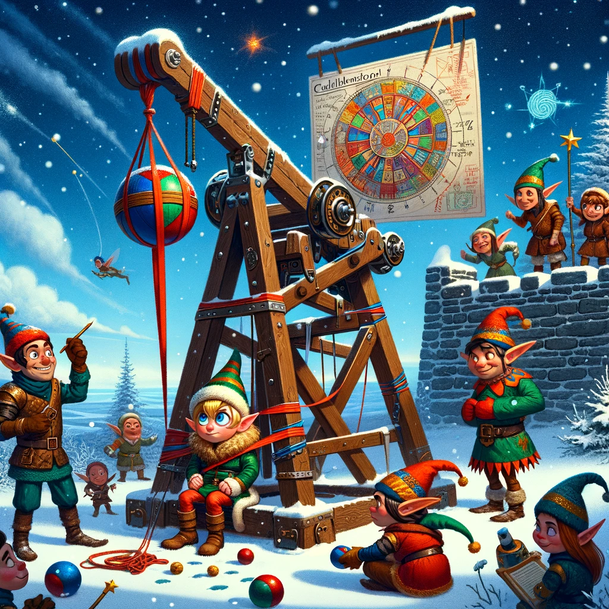
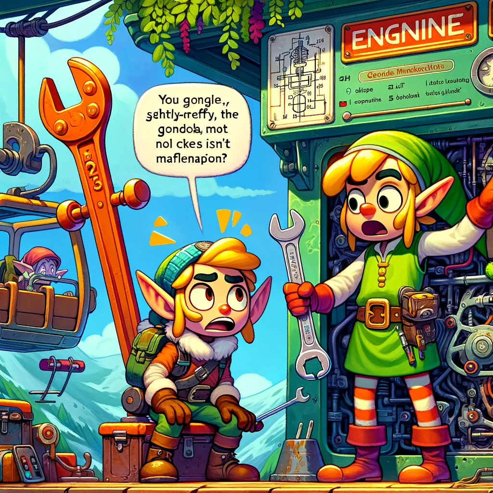
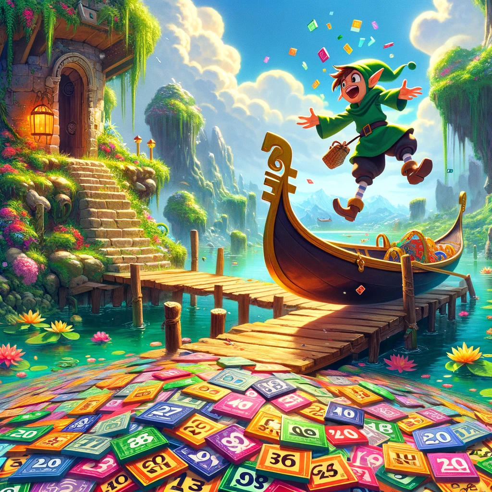

# Advent of Code
Eric Wastl [Advent of Code](adventofcode.com).

## DALL·3 generated images on each day problem.

<table>
  <tr>
    <td></td>
    <td></td>
    <td></td>
    <td></td>
  </tr>
  <tr>
    <td></td>
    <td></td>    
    <td></td>
    <td></td>
  </tr>
  <tr>
    <td></td>
    <td></td>    
    <td></td>
    <td></td>
  </tr>
  <tr>
    <td></td>
    <td></td>    
    <td></td>
    <td></td>
  </tr>
  <tr>
    <td></td>
    <td></td>    
    <td></td>
    <td></td>
  </tr>
  <tr>
    <td></td>
    <td></td>    
    <td></td>
    <td></td>
  </tr>
</table>
